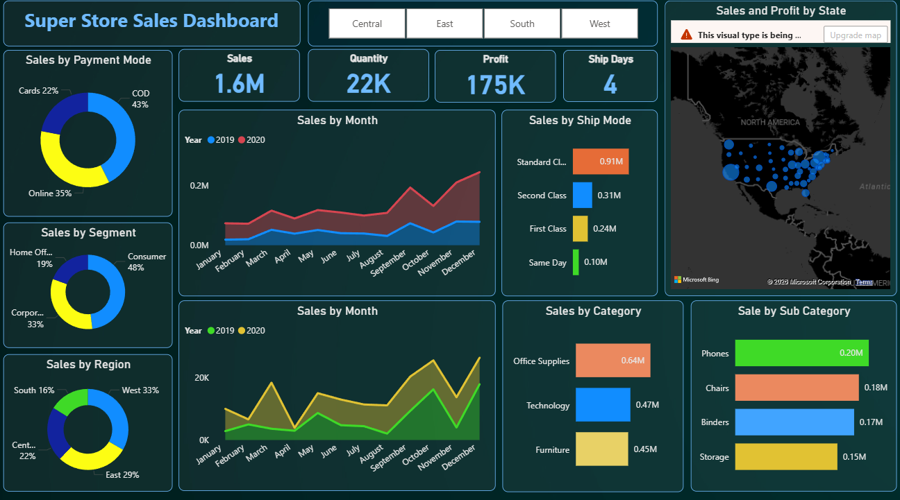
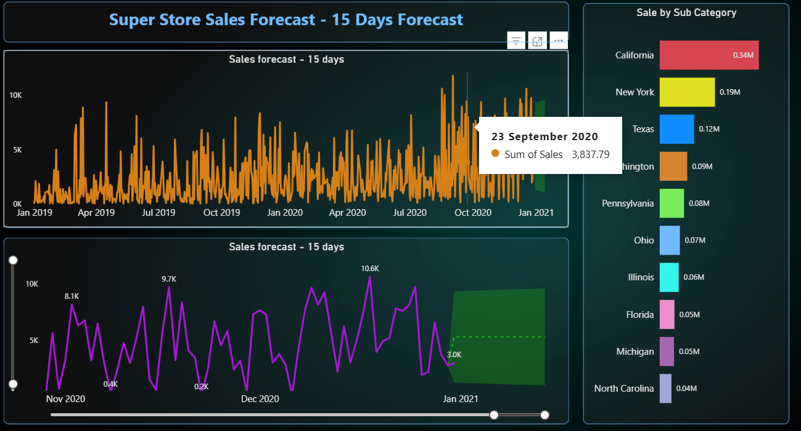

# Sales Analytics & Forecasting Dashboard | Power BI

## Project Overview

This project is an interactive Sales Analytics & Forecasting Dashboard developed using Microsoft Power BI. The dashboard transforms raw sales data into meaningful business insights through data visualization, KPI tracking, and forecasting techniques.

The objective of this project is to help businesses monitor performance, identify sales trends, analyze regional growth, and make data-driven strategic decisions using an interactive and user-friendly dashboard.

---

# Business Problem

Businesses often struggle to monitor sales performance, identify profitable regions, and forecast future growth from raw datasets. Traditional spreadsheets make it difficult to extract actionable insights efficiently.

This dashboard was created to centralize sales data analysis and provide decision-makers with an interactive reporting solution for tracking KPIs, sales trends, profitability, and future sales forecasting.

---

# Project Objectives

* Analyze overall sales performance
* Track revenue and profit trends
* Identify top-performing regions and product categories
* Monitor business KPIs through interactive visuals
* Forecast future sales performance using historical data
* Build a business-friendly and interactive analytics dashboard

---

# Tools & Technologies Used

* Microsoft Power BI
* Power Query
* DAX (Data Analysis Expressions)
* Data Cleaning & Transformation
* Data Visualization
* Forecasting & Trend Analysis

---

# Dashboard Features

## Sales Performance Dashboard

The dashboard provides a complete overview of business performance using:

* KPI Cards for Revenue, Profit, and Sales Metrics
* Category-wise Sales Analysis
* Regional Sales Performance Analysis
* Interactive Filters & Slicers
* Time-Series Trend Analysis
* Geographic Sales Visualization
* Profitability Insights

## Sales Forecast Dashboard

The forecasting section helps predict future business performance using historical sales data.

Features include:

* Time-Series Forecasting
* Future Revenue Prediction
* Comparative Sales Trend Analysis
* Forecast Visualization for Strategic Planning

---

# Key Insights

* Identified high-performing sales regions contributing the highest revenue
* Analyzed category-wise sales contribution and profitability
* Detected seasonal sales trends and growth patterns
* Compared business performance across different segments
* Forecasted future sales trends for better planning and decision-making

---

# Technical Highlights

* Built multiple interactive dashboard visuals
* Created KPI measures using DAX
* Implemented forecasting and trend analysis
* Performed data cleaning and transformation using Power Query
* Designed interactive slicers and filters for dynamic reporting
* Developed a business-oriented dashboard layout for easy interpretation

---

# Skills Demonstrated

* Data Analysis
* Business Intelligence
* Dashboard Development
* Data Visualization
* KPI Reporting
* Forecasting & Trend Analysis
* Power BI Development
* DAX & Power Query
* Business Analytics
* Problem Solving

---

# Business Value

This dashboard enables stakeholders to:

* Monitor sales performance effectively
* Identify profitable business areas
* Track KPIs in real time
* Support strategic business decisions
* Improve forecasting and planning accuracy
* Understand sales trends and growth opportunities

---

# Project Structure

```plaintext
Sales-Analytics-Dashboard/
│
├── Sales Dashboard.pbix
├── README.md
├── dataset/
├── screenshots/
```

---

# Dashboard Preview

## Main Dashboard


```markdown

```

## Forecast Dashboard

```markdown

```

---

# How to Use

1. Download the `.pbix` file
2. Open the file using Microsoft Power BI Desktop
3. Explore interactive dashboards and filters
4. Analyze KPIs, trends, and forecasting insights

---

# Key Learnings

* Improved dashboard storytelling and visualization skills
* Strengthened DAX and Power Query concepts
* Learned business-focused data analysis techniques
* Gained practical experience in forecasting and KPI reporting
* Improved understanding of business intelligence workflows

---

# Future Improvements

* Add advanced DAX calculations
* Integrate real-time datasets
* Add customer segmentation analysis
* Improve forecasting models
* Develop mobile-optimized dashboard views

---

# Author

Piyush Singh

Data Analyst | Business Analyst | Power BI Enthusiast
